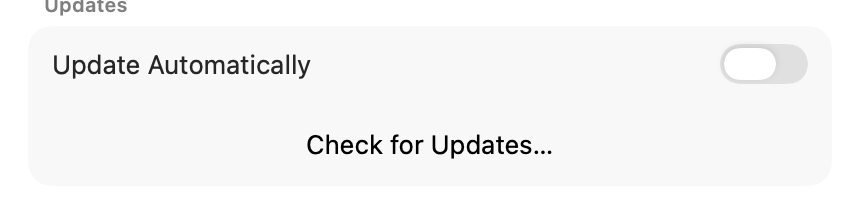

# Updates

Runway keeps itself up to date using [Sparkle](https://sparkle-project.org), the standard update
framework for Mac apps. The app downloads updates from Runway's own release feed and verifies them
before they install, so you always get a genuine, unmodified build.

## How it works

- **Automatic checks.** The app quietly checks for a new version in the background (about once an hour).
  When one is found, an **Update Available** banner appears at the top of the popover instead of a
  window popping up behind your other apps. Click **Install Update** to open the update window (release
  notes, download, install) front and center. The banner's close button snoozes it; it comes back the
  next time the app finds the update.
- **Manual check.** Open **Settings → Advanced → Updates** and click **Check for Updates…** at any time.
  For both manual checks and banner installs, Runway brings itself to the foreground before opening
  Sparkle so the update window doesn't get buried behind another app. Because Runway normally lives
  only in the menu bar, it briefly shows a Dock icon for the update session, then hides again.
- **Turn it off.** The **Update Automatically** switch in **Settings → Advanced → Updates** stops the
  background checks. You can still check manually.

## Where updates come from

Runway publishes stable update builds on its GitHub releases and serves the list of available versions
(the "appcast") from `https://mstallone.github.io/runway/appcast.xml`. Each download is
signed two ways — Apple notarization plus Runway's own signature — and the app refuses anything that
doesn't match. This is only available in the official signed release build, not in local developer
builds.
